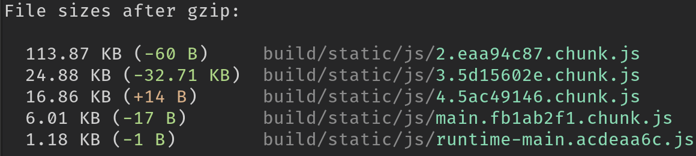

# create react app with preact

### _Love the CRA bootstrap? Hate big bundle sizes?_

```sh
npm i -D cra-preact
# or
yarn add --dev cra-preact
```

Write your code as if you weren't using `preact`, continue importing `react`.

## usage

Replace your `build` and `start` scripts

```diff
"scripts": {
-	"start": "react-scripts start",
+	"start": "cra-preact start",
-	"build": "react-scripts build",
+	"build": "cra-preact build",
    "test": "react-scripts test",
    "eject": "react-scripts eject"
}
```

Cool, done. Now watch the bundle size go down.

## bundle size drop porn

### initial CRA bootstrap

### medium size real-world production project



## disclaimer

While rare, problems may occur.

- Please be aware that `cra-preact` is using preact's compatibility layer (`preact/compat`) and issues with it should be directed to [preact's repo](https://github.com/preactjs/preact/issues)
- Make sure to develop under the `cra-preact start` script to catch incompatibilities during development
- This project requires react-scripts v3+
- It is **NOT** recommended to plug this into existing projects just as a build script. Incompatibilities will most likely come out during runtime, not compile time
